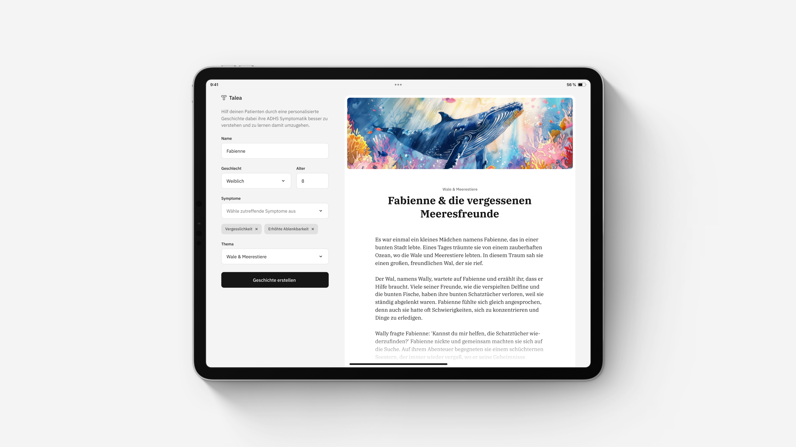

# Talea

Next.js prototype using AI to generate personalized stories that help children with ADHD understand themselves and their symptoms.



## Features

-   **AI-Powered Stories:** Generate personalized stories using ChatGPT
-   **Customizable Settings:** Tailor stories by age, gender and symptoms
-   **Story Themes:** Choose from a variety of themes and scenarios

## Technologies

-   **Framework:** [Next.js](https://nextjs.org)
-   **Styling:** [Styled Components](https://styled-components.com/)
-   **AI:** [OpenAI/ChatGPT](https://openai.com/)
-   **Icons:** [Google](https://fonts.google.com/icons)

## Getting Started

### Prerequisites

-   [Node.js](https://nodejs.org) installed
-   An [OpenAI](https://openai.com/) API key

### Installation

1. Clone the repository:

    ```bash
    git clone https://github.com/benjaminpfleghaar/talea.git
    ```

2. Install dependencies:

    ```bash
    npm install
    ```

3. Create a `.env.local` file and add your credentials:

    ```bash
    OPENAI_API_KEY=<YOUR_KEY>
    ```

4. Run the development server:

    ```bash
    npm run dev
    ```
